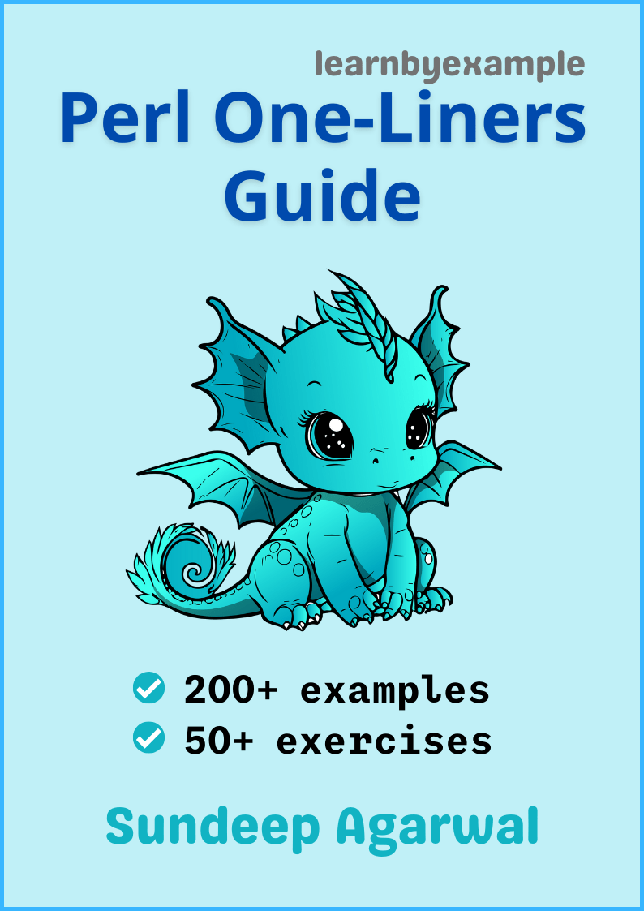

# Perl one-liners cookbook

Example based guide for text processing with `perl` from the command line.

    

The book also includes exercises to test your understanding, which is presented together as a single file in this repo — [Exercises.md](./exercises/Exercises.md)

For solutions to the exercises, see [Exercise_solutions.md](./exercises/Exercise_solutions.md).

See [Version_changes.md](./Version_changes.md) to keep track of changes made to the book.

 

# E-book

You can purchase the pdf/epub versions of the book using these links:

* https://learnbyexample.gumroad.com/l/perl-oneliners
* https://leanpub.com/perl-oneliners

You can also get the book as part of these bundles:

* **Magical one-liners** bundle from https://learnbyexample.gumroad.com/l/oneliners or https://leanpub.com/b/oneliners
* **All books bundle** bundle from https://learnbyexample.gumroad.com/l/all-books
    * Includes all my programming books

See https://learnbyexample.github.io/books/ for list of other books

For a preview of the book, see [sample chapters](https://github.com/learnbyexample/learn_perl_oneliners/blob/main/sample_chapters/perl_oneliners_sample.pdf)

The book can also be [viewed as a single markdown file in this repo](./perl_oneliners.md). See my blogpost on [generating pdf/epub from markdown using pandoc](https://learnbyexample.github.io/customizing-pandoc/) if you are interested in the ebook creation process.

For web version of the book, visit https://learnbyexample.github.io/learn_perl_oneliners/

 

# Feedback

Please [open an issue](https://github.com/learnbyexample/learn_perl_oneliners/issues) if you spot any typo/errors.

⚠️ ⚠️ Please DO NOT submit pull requests. Main reason being any modification requires changes in multiple places.

I'd also highly appreciate your feedback about the book.

Twitter: https://twitter.com/learn_byexample

 

# Table of Contents

1) Preface
2) One-liner introduction
3) Line processing
4) In-place file editing
5) Field separators
6) Record separators
7) Using modules
8) Multiple file input
9) Processing multiple records
10) Two file processing
11) Dealing with duplicates
12) Perl rename command

 

# Acknowledgements

* [perl documentation](https://perldoc.perl.org/) — manuals, tutorials and examples
* [/r/perl/](https://www.reddit.com/r/perl/) — helpful forum for beginners and experienced programmers alike
* [stackoverflow](https://stackoverflow.com/) — for getting answers to pertinent questions on Perl, one-liners, etc
* [tex.stackexchange](https://tex.stackexchange.com/) — for help on `pandoc` and `tex` related questions
* [LibreOffice Draw](https://www.libreoffice.org/discover/draw/) — cover image
* [pngquant](https://pngquant.org/) and [svgcleaner](https://github.com/RazrFalcon/svgcleaner) for optimizing images
* [Warning](https://commons.wikimedia.org/wiki/File:Warning_icon.svg) and [Info](https://commons.wikimedia.org/wiki/File:Info_icon_002.svg) icons by [Amada44](https://commons.wikimedia.org/wiki/User:Amada44) under public domain
* [softwareengineering.stackexchange](https://softwareengineering.stackexchange.com/questions/39/whats-your-favourite-quote-about-programming) and [skolakoda](https://skolakoda.org/programming-quotes) for programming quotes
* [mdBook](https://github.com/rust-lang/mdBook) — for web version of the book
    * [mdBook-pagetoc](https://github.com/JorelAli/mdBook-pagetoc) — for adding table of contents for each chapter
    * [minify-html](https://github.com/wilsonzlin/minify-html) — for minifying html files

A heartfelt thanks to all my readers. Your valuable support has significantly eased my financial concerns and allows me to continue writing books.

 

# License

The book is licensed under a [Creative Commons Attribution-NonCommercial-ShareAlike 4.0 International License](https://creativecommons.org/licenses/by-nc-sa/4.0/)

The code snippets are licensed under MIT, see [LICENSE](./LICENSE) file

